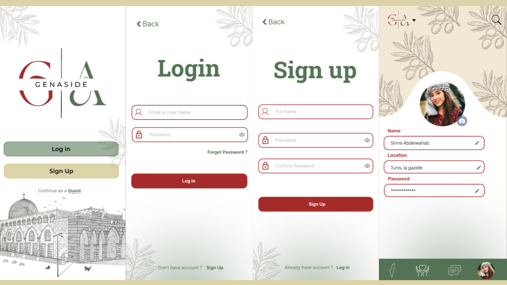
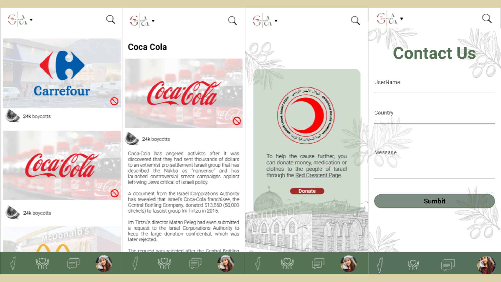

# GenAside

GenAside is an application that aims to help people identify and find alternatives to brands that supports the Palestinian occupation.
It aims at providing detailed information on how these brands exactly support israel, and the effect of the boycott on these companies.

## Table of Contents

- [Introduction](#introduction)
- [Features](#features)
- [Getting Started](#getting-started)
  - [Prerequisites](#prerequisites)
  - [Installation](#installation)
  - [Usage](#usage)
- [Contributing](#contributing)
- [License](#license)
- [Acknowledgments](#acknowledgments)

## Introduction
GenAside is an application designed to empower individuals to make informed and ethical choices by providing comprehensive information on brands associated with the Palestinian occupation. Our mission is to shed light on the relationships between companies and the Israeli government, enabling users to make conscientious decisions aligned with their values.
## Features

Key Features:

**Brand Identification:**

GenAside helps users identify brands linked to the Israeli occupation of Palestine.
It employs a comprehensive database that highlights companies with documented connections to Israel.

**Detailed Information:**

The application provides detailed insights into how these brands support Israel.
Users can access information on financial contributions, partnerships, and other forms of support, offering a nuanced understanding.

**Alternatives Suggestion:**

GenAside doesn't just stop at highlighting problematic brands; it offers users ethical alternatives.
Users can discover and support brands committed to ethical business practices and social responsibility.
Boycott Impact Analysis:

The app goes beyond information dissemination; it analyzes and showcases the potential impact of the boycott on these companies.
Users gain a clear understanding of how their choices contribute to collective efforts in advocating for justice.

**Why GenAside:**

- Transparency and Accountability:
<<<<<<< HEAD
GenAside operates on the principles of transparency and accountability, aiming to hold brands responsible for their actions.

- Consumer Empowerment:
By providing detailed information, GenAside empowers consumers to align their purchasing decisions with their values, fostering a sense of agency.

- Collective Advocacy:
The app serves as a platform for collective advocacy, allowing users to contribute to positive change through their everyday choices.

- Educational Resource:
GenAside acts as an educational resource, fostering awareness and understanding of the complexities surrounding the Israeli-Palestinian conflict.
=======
  GenAside operates on the principles of transparency and accountability, aiming to hold brands responsible for their actions.

- Consumer Empowerment:
  By providing detailed information, GenAside empowers consumers to align their purchasing decisions with their values, fostering a sense of agency.

- Collective Advocacy:
  The app serves as a platform for collective advocacy, allowing users to contribute to positive change through their everyday choices.

- Educational Resource:
  GenAside acts as an educational resource, fostering awareness and understanding of the complexities surrounding the Israeli-Palestinian conflict.

**Join GenAside and Make Your Choices Count!**

GenAside invites users to join a community of conscious consumers, advocating for justice through their purchasing decisions. Together, we can make a meaningful impact and contribute to positive change in the world. Download GenAside today and be part of the movement for ethical and responsible consumerism.

## UI Design
For this project, we used Figma to have a mockup of the UI/UX Design.
You can access the figma template in via [this link](https://www.figma.com/proto/RrVgXYD1drzgJq9wyqXeca/GenAside?type=design&node-id=67-47&t=cllQVyJGpb1Y0vfi-1&scaling=scale-down&page-id=0%3A1&starting-point-node-id=67%3A47&mode=design).
Also we have below the sample images of the UI design that integrates elements that characterize the Palestinian country all in a minimalistic and easy to use style.



## Getting Started

### Prerequisites

Before you begin, please ensure you have met the following requirements:

1. **Flutter SDK:**
<<<<<<< HEAD
  - Install the Flutter SDK by following the official [Flutter installation guide](https://flutter.dev/docs/get-started/install).

2. **Dart SDK:**
  - Flutter relies on the Dart programming language. Make sure you have the Dart SDK installed, which usually comes bundled with Flutter.

3. **IDE (Integrated Development Environment):**
  - We recommend using [Visual Studio Code](https://code.visualstudio.com/) with the [Flutter and Dart extensions](https://flutter.dev/docs/get-started/editor?tab=vscode) for an optimal development experience.
  - Alternatively, you can use [Android Studio](https://developer.android.com/studio) with the Flutter plugin.

4. **Device/Emulator:**
  - To run and test your Flutter app, you need either a physical device connected to your development machine or a configured emulator.
  - Follow the instructions in the [Flutter documentation](https://flutter.dev/docs/get-started/install) to set up a device or emulator.

5. **Git (Optional, for contributors):**
  - If you plan to contribute to the project, it's recommended to have Git installed on your machine.
  - Install Git by following the instructions on the [official Git website](https://git-scm.com/book/en/v2/Getting-Started-Installing-Git).
=======
- Install the Flutter SDK by following the official [Flutter installation guide](https://flutter.dev/docs/get-started/install).

2. **Dart SDK:**
- Flutter relies on the Dart programming language. Make sure you have the Dart SDK installed, which usually comes bundled with Flutter.

3. **IDE (Integrated Development Environment):**
- We recommend using [Visual Studio Code](https://code.visualstudio.com/) with the [Flutter and Dart extensions](https://flutter.dev/docs/get-started/editor?tab=vscode) for an optimal development experience.
- Alternatively, you can use [Android Studio](https://developer.android.com/studio) with the Flutter plugin.

4. **Device/Emulator:**
- To run and test your Flutter app, you need either a physical device connected to your development machine or a configured emulator.
- Follow the instructions in the [Flutter documentation](https://flutter.dev/docs/get-started/install) to set up a device or emulator.

5. **Git (Optional, for contributors):**
- If you plan to contribute to the project, it's recommended to have Git installed on your machine.
- Install Git by following the instructions on the [official Git website](https://git-scm.com/book/en/v2/Getting-Started-Installing-Git).


### Installation
```bash
# Example installation commands
git clone https://github.com/onstriqui/GenAside.git

